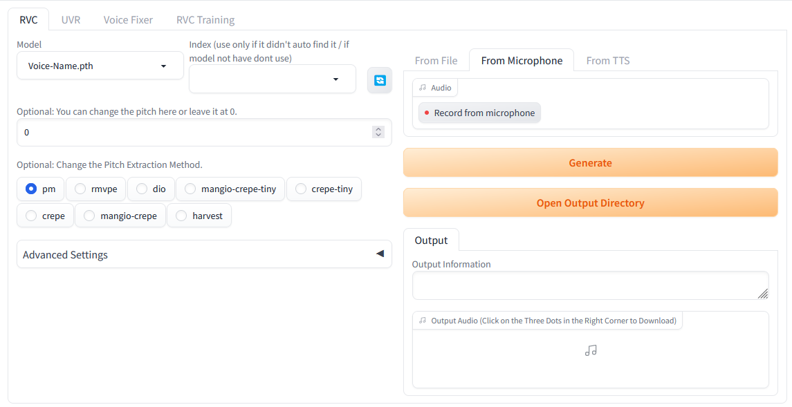

# sd-webui-rvc
### This is test version, you are completely responsible for using this. This is your own risk.
[TEST] This extension is the adaptation of RVC / UVR / VoiceFixer for [AUTOMATIC1111's WebUI](https://github.com/AUTOMATIC1111/stable-diffusion-webui)




## Requirements
nVidia GPU

"--disable-safe-unpickle" parameter is needed for loading hubert model.(Add to webui-user.bat/webui-user.sh)

Cuda Toolkit - (Tested with 11.6, Maybe it's not necessary)

#### For Linux
 You need wget & ffmpeg & ffprobe.
 This project optimized on windows, I have no idea about results.

## Installation

Enter the URL from "Install from URL" in Extensions tab.
```
https://github.com/seto-kaiba-0/sd-webui-rvc.git
```
Click "Install" button.

### RVC Model Installation
  1.Extract your model files (.pth files) (from zip) to {WebUI Main} / RVC / weights folder
  
  2.Extract your index files (.index files) (from zip) to {WebUI Main} / RVC / logs folder

### Output Location
{WebUI Main}/outputs/RVC


## Credits
[RVC-Project/Retrieval-based-Voice-Conversion-WebUI](https://github.com/RVC-Project/Retrieval-based-Voice-Conversion-WebUI)

[haoheliu/voicefixer](https://github.com/haoheliu/voicefixer)

[Anjok07&aufr33/ultimatevocalremovergui](https://github.com/Anjok07/ultimatevocalremovergui)

### Tools
FFMpeg & wget

Some Colabs but I forgot which ones. Sory about that.
